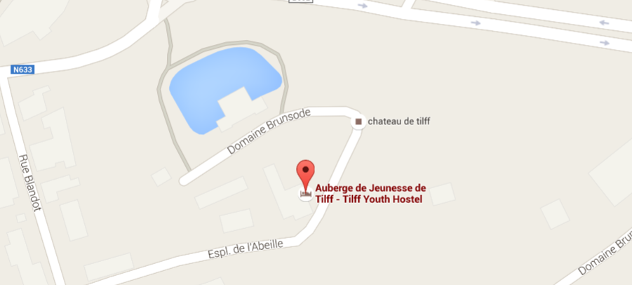

# Accomodation: La Ferme du Château

This is an [old farmhouse](http://www.ajtilff.be), one of the outbuildings of
the castle of Brunsode in [Tilff](https://fr.wikipedia.org/wiki/Tilff). It dates
from the 18th century.

[Auberge de Jeunesse de Tilff - Tilff Youth Hostel](https://goo.gl/maps/uRmvv)
Espl. de l'Abeille 9
4130 Tilff
Belgique

[Open the map](https://goo.gl/maps/uRmvv)

## Checkin - Checkout

You can arrive after 8.00 PM on Friday (to be confirmed!).
We have to leave before 4PM on Sunday.

## What do you need to bring?

Pillows and blankets are provided.
You need to bring your own sheets, towels, and your own toiletries (e.g. soap).

## What I have to do before leaving?

Before leaving, you have to clean your room and help to tidy the common rooms
and wash the dishes.

## Rooms

Each room has its own shower and sink. There are 8 rooms:

* 4 rooms 2 sets of bunk-beds (4 persons)
* 2 room 1 bunk-bed (2 persons)
* 1 room 2 beds (2 persons)
* 1 room 4 sets of bunk-beds (8 persons)
* 1 room 2 beds for persons with reduced mobility (2 persons)

The allocation will be organized soon.

## Internet Connection

None are provided. If you really want one, use your mobile.

## Meals and Drinks

[Breakfast, Lunch, and Dinner are provided](menu.md). The different diets are taken into
account as much as possible.

As we run on a very limited budget, we'll bring very few snacks such as salt
salts. If you want some cakes, biscuits, appetizers, or any other sweeties or
salties, please bring them with you and share it! Sharing food is one of the
best way to meet each other ;).

Common soft drinks are provided such as tea or coffee. Pils are the only
provided alcoholic beverage. If you want a good wine, a special beer, a strange
soft drink, feel free to bring it. Please do not forget, it is not a drinking
weekend.

## How to come?

Tilff is [accessible by bike, train, bus, or car](http://www.sitilff.be/venir/venir-a-tilff/).
A [carpooling](carpooling.md) is also organized by the participants.

## Code of Conduct

Do not forget, we are dedicated to provide a harassment-free camp for everyone.
We do not tolerate harassment and unappropriate behavior. We follow the same
[Code of Conduct than Arrrrcamp](http://2015.arrrrcamp.be/coc/).
